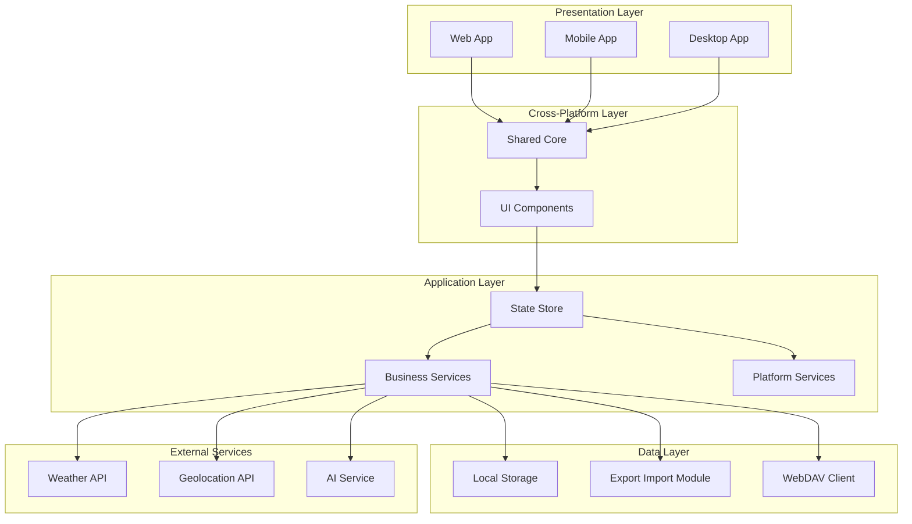
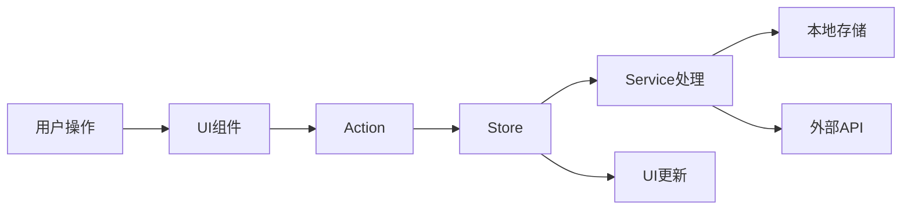

# Design Document - Notebook App

Feature Name: notebook-app
Updated: 2026-01-31

## Description

笔记本应用是一个支持模板化记录的个人日记跨平台应用。应用支持 Web 端、移动端（iOS/Android）和桌面端三种形态，数据存储在设备本地，支持模板自定义、多场景记录、数据导出导入和 WebDAV 备份等核心功能。

## Architecture

### 多平台架构图



### 数据流图



## Components and Interfaces

### 核心组件

| 组件名称 | 职责 |
|---------|------|
| **TemplateManager** | 管理日记模板的创建、编辑、删除和存储 |
| **DiaryManager** | 管理日记条目的创建、编辑、删除、查询 |
| **FieldRenderer** | 根据模板配置渲染不同的表单字段 |
| **StorageService** | 提供本地存储的封装接口 |
| **ExportImportService** | 处理数据的导出和导入逻辑 |
| **WebDAVService** | 处理 WebDAV 协议的数据同步 |
| **WeatherService** | 获取天气信息 |
| **GeolocationService** | 获取地理位置信息 |
| **AIService** | 调用 AI 服务生成日记摘要 |
| **SearchService** | 提供日记搜索功能 |
| **BackupReminder** | 管理备份提醒逻辑 |
| **ResponsiveLayout** | 响应式布局管理，适配移动端和桌面端 |
| **MobilePlatformService** | 移动端平台特定功能（通知、小组件、相机） |
| **DesktopPlatformService** | 桌面端平台特定功能（托盘、快捷键、离线模式） |

### 接口定义

#### ITemplate

```typescript
interface ITemplate {
    id: string;                    // 模板唯一标识
    name: string;                  // 模板名称
    category: string;              // 关联分类
    fields: TemplateField[];       // 模板字段列表
    createdAt: number;             // 创建时间戳
    updatedAt: number;             // 更新时间戳
}
```

#### ITemplateField

```typescript
interface ITemplateField {
    type: FieldType;               // 字段类型
    enabled: boolean;              // 是否启用
    required?: boolean;            // 是否必填
    options?: FieldOptions;        // 字段配置选项
}

type FieldType =
    | 'date'                       // 日期
    | 'time'                       // 时间
    | 'location'                   // 地点
    | 'weather'                    // 天气
    | 'mood'                       // 心情
    | 'content'                    // 正文内容
    | 'tags'                       // 标签
    | 'images'                     // 图片
    | 'ai-summary';                // AI总结
```

#### IDiaryEntry

```typescript
interface IDiaryEntry {
    id: string;                    // 日记唯一标识
    templateId: string;            // 关联模板ID
    templateName: string;          // 模板名称（冗余，方便查询）
    category: string;              // 分类
    fields: DiaryFieldData[];      // 字段数据
    createdAt: number;             // 创建时间戳
    updatedAt: number;             // 更新时间戳
}
```

#### IDiaryFieldData

```typescript
interface IDiaryFieldData {
    type: FieldType;               // 字段类型
    value: FieldValue;             // 字段值
}

type FieldValue =
    | string                       // 文本值（日期、时间、地点、天气、心情、标签、正文、摘要）
    | string[]                     // 数组值（多标签）
    | ImageData[];                 // 图片数据
```

#### IImageData

```typescript
interface IImageData {
    id: string;                    // 图片唯一标识
    dataUrl: string;               // Base64 编码的图片数据
    name: string;                  // 图片名称
    size: number;                  // 图片大小（字节）
}
```

#### IExportData

```typescript
interface IExportData {
    version: string;               // 数据版本
    exportedAt: number;            // 导出时间戳
    templates: ITemplate[];        // 模板列表
    diaryEntries: IDiaryEntry[];   // 日记条目列表
    metadata: {
        totalTemplates: number;    // 模板总数
        totalEntries: number;      // 日记总数
    };
}
```

#### IWebDAVConfig

```typescript
interface IWebDAVConfig {
    url: string;                   // WebDAV 服务器 URL
    username?: string;             // 用户名（可选）
    password?: string;             // 密码（可选）
    enabled: boolean;              // 是否启用
}
```

### Store State

```typescript
interface IStoreState {
    templates: {
        items: ITemplate[];
        loading: boolean;
        error: string | null;
    };
    diaryEntries: {
        items: IDiaryEntry[];
        filteredItems: IDiaryEntry[];
        loading: boolean;
        error: string | null;
        filter: {
            category: string | null;
            searchQuery: string;
        };
    };
    ui: {
        currentPage: string;
        selectedTemplateId: string | null;
        selectedEntryId: string | null;
        isEditorOpen: boolean;
        platform: PlatformType;           // 当前运行平台
        layoutMode: LayoutMode;           // 当前布局模式（移动/桌面）
    };
    backup: {
        webDAVConfig: IWebDAVConfig;
        lastBackupTime: number | null;
        reminderDismissedUntil: number | null;
    };
}

type PlatformType = 'web' | 'ios' | 'android' | 'windows' | 'macos' | 'linux';
type LayoutMode = 'mobile' | 'desktop';
```

#### IPlatformCapabilities

```typescript
interface IPlatformCapabilities {
    supportsNotifications: boolean;       // 是否支持通知推送
    supportsWidget: boolean;             // 是否支持小组件
    supportsCamera: boolean;             // 是否支持相机
    supportsTray: boolean;               // 是否支持托盘图标
    supportsGlobalHotkey: boolean;       // 是否支持全局快捷键
    supportsOfflineMode: boolean;         // 是否支持完整离线模式
}
```

## Data Models

### 本地存储数据结构

```
local-storage/
├── notebook_app/
│   ├── templates/              # 模板数据
│   │   └── {templateId}.json   # 单个模板文件
│   ├── entries/                # 日记条目数据
│   │   └── {entryId}.json      # 单个日记条目文件
│   ├── drafts/                 # 草稿数据（移动端）
│   │   └── {draftId}.json      # 草稿文件
│   └── metadata.json           # 元数据（备份时间、配置等）
```

### 元数据结构

```json
{
    "version": "1.0.0",
    "lastBackupTime": 1738284800000,
    "platform": "ios",
    "webDAVConfig": {
        "url": "",
        "username": "",
        "password": "",
        "enabled": false
    },
    "settings": {
        "autoSaveDraft": true,
        "notificationEnabled": true,
        "theme": "light"
    }
}
```

### 技术选型

| 平台 | 技术方案 | 说明 |
|------|---------|------|
| **Web** | React + Vite | 纯前端 Web 应用 |
| **移动端** | React Native / Capacitor | 跨平台移动端应用 |
| **桌面端** | Electron / Tauri | 跨平台桌面应用 |

## Correctness Properties

### 不变性约束

1. **模板唯一性**: 模板 ID 在系统中必须唯一
2. **日记唯一性**: 日记条目 ID 在系统中必须唯一
3. **模板引用完整性**: 日记条目的 templateId 必须引用存在的模板
4. **时间顺序性**: createdAt 时间戳不得晚于 updatedAt 时间戳
5. **数据一致性**: 导出/导入操作必须保持数据的完整性

### 业务规则

1. **模板删除约束**: 已关联日记条目的模板不允许删除
2. **必填字段验证**: 保存日记前必填字段必须填写完整
3. **日期范围限制**: 日期字段必须为有效的日期值
4. **图片大小限制**: 单个图片不超过 5MB，单个日记图片总数不超过 10 张
5. **响应式断点**: 屏幕宽度小于 768px 启用移动端布局，否则启用桌面端布局
6. **草稿自动保存**: 移动端编辑日记时每隔 30 秒自动保存草稿
7. **平台功能降级**: 当平台不支持特定功能时，隐藏或禁用该功能对应的 UI 元素

## Error Handling

### 错误分类

| 错误类型 | 场景 | 处理策略 |
|---------|------|---------|
| **存储错误** | 本地存储空间不足、写入失败 | 显示友好提示，建议用户导出备份 |
| **导入错误** | 文件格式无效、JSON 解析失败 | 显示具体错误信息，提示用户选择有效文件 |
| **网络错误** | 天气 API 调用失败、WebDAV 连接失败 | 显示错误原因，支持离线操作模式 |
| **位置服务错误** | 用户拒绝定位、定位超时 | 允许手动输入地点信息 |
| **AI 服务错误** | AI 摘要生成失败 | 显示生成失败提示，允许用户手动补充 |
| **验证错误** | 字段验证不通过 | 在对应字段位置显示错误提示 |
| **相机权限错误** | 用户拒绝相机权限 | 提示用户授予权限或从相册选择图片 |
| **平台功能错误** | 平台不支持某功能 | 自动降级或隐藏该功能 |

### 错误提示文案

```
- 存储错误: "存储空间不足，建议导出数据备份后清理"
- 导入格式错误: "文件格式不正确，请选择有效的导出文件"
- 网络错误: "网络连接失败，请检查网络后重试"
- 定位失败: "无法获取位置信息，请手动输入地点"
- AI 失败: "摘要生成失败，您可以稍后手动添加"
```

## Test Strategy

### 单元测试

1. **模板管理测试**
   - 测试模板创建、编辑、删除逻辑
   - 测试模板字段配置的持久化
   - 测试模板删除约束验证

2. **日记管理测试**
   - 测试日记条目的增删改查
   - 测试字段数据类型的正确性
   - 测试时间戳的正确更新

3. **服务层测试**
   - 测试存储服务的读写操作
   - 测试导出/导入的数据完整性
   - 测试搜索功能的匹配逻辑

### 集成测试

1. **数据持久化测试**
   - 测试页面刷新后数据恢复
   - 测试跨会话数据一致性

2. **导出/导入测试**
   - 测试完整数据的导出和导入
   - 测试合并模式和覆盖模式的正确性

### E2E 测试

1. **用户流程测试**
   - 完整的创建模板 -> 写日记 -> 查看日记流程
   - 导出 -> 清空数据 -> 导入恢复流程

2. **异常流程测试**
   - 网络失败时的降级处理
   - 存储不足时的错误提示

3. **多平台兼容性测试**
   - 移动端和桌面端界面适配测试
   - 跨平台数据同步测试

## References

[^1]: (外部链接) - [EARS (Easy Approach to Requirements Syntax)](https://www.stsc.hill.af.mil/consulting/everything/ears/)
[^2]: (外部链接) - [INCOSE Requirements Quality Rules](https://www.incose.org/)
[^3]: (外部链接) - [WebDAV Specification RFC 4918](https://tools.ietf.org/html/rfc4918)
[^4]: (外部链接) - [Web Storage API](https://developer.mozilla.org/en-US/docs/Web/API/Web_Storage_API)
[^5]: (外部链接) - [React Native Documentation](https://reactnative.dev/)
[^6]: (外部链接) - [Capacitor Documentation](https://capacitorjs.com/)
[^7]: (外部链接) - [Electron Documentation](https://www.electronjs.org/)
[^8]: (外部链接) - [Tauri Documentation](https://tauri.app/)
[^9]: (外部链接) - [Responsive Web Design](https://developer.mozilla.org/en-US/docs/Learn/CSS/CSS_layout/Responsive_Design)
